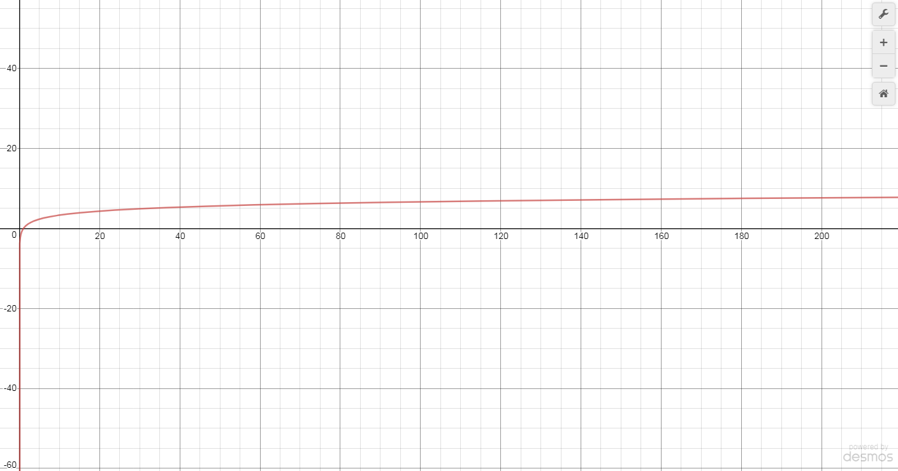

# 60_wrapBinarySearch

**y=log(x)**
In terms of algorithmic analysis, the logarithm function measures the time (y) at which an algorithm can complete an x-sized task. This function means that the time that the algorithm takes to complete a task scales with how many times that task can be halved.

The graph looks like this:

# Recursive Solution
  0. Create a search algorithm to find a target element in a sorted array
  1. Given the task to find an element in a sorted array, the recursive abstraction can find the element in half the sorted array.
  2. 0. If the length of the array is 0, return -1. If the length of the array is 1, return the first element.  
     1. If the target element is before the current page,  
        a. apply the algorithm to the first half of the array  
        b. else if the target element is after the current page,  
        c. apply the algorithm to the second half of the array 
